<h3 align="center">Coding Enthusiast || Passionate about Algorithms & Application Development</h3>

 

- 🎓 I'm currently pursuing Engineering in Computer Science(Data Science)
- 🌱 "Currently expanding my expertise in DSA, Full-stack Web Development, and building Desktop Applications (GUI)."
- 💻 All of my projects are available at https://github.com/sarash019
- 📧 How to reach me: **sarashsingh019@gmail.com**
- 📄 Know about my experiences: [My Resume](https://drive.google.com/file/d/1Pq-eUOgO12dCd20l_8sikGrIJv50Bkqf/view?usp=drivesdk)

 

### Connect with me:

  
  
  
  

 

### Languages and Tools:
### Languages and Tools:

  
  
  
  
  
  
  
  
  
  
  
  

 

<table>
  <tr>
    <td width="50%">
      
    </td>
    <td width="50%">
      
    </td>
  </tr>
</table>

  

